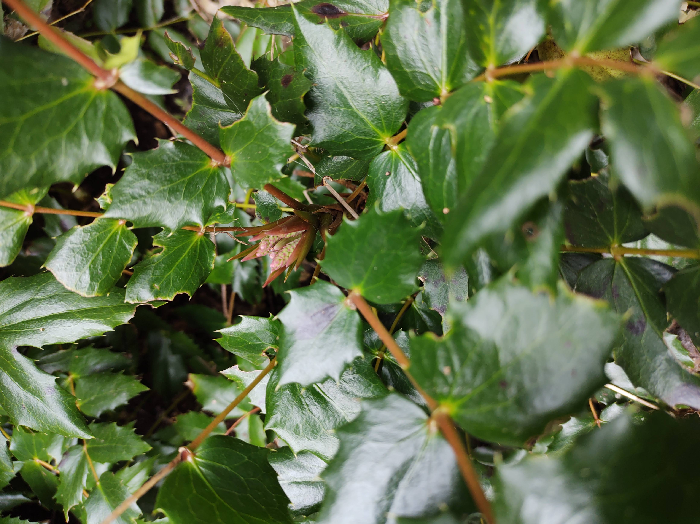

Inspired by Toke Høye’s PollinatorWatch (hosted by [Zooniverse](https://www.zooniverse.org/), we are setting up time-lapse cameras to gather hundreds or maybe thousands of images of pollinators visiting two common native flowering plants, salal and dull Oregon grape, at a mid-island location on Galiano Island, in the Pacific Northwest.   

We plan to automate the analysis of the images to document the number and type of pollinator visitors we get over the flowering season.   

We have also set up a weather station, weather sensors and a particulate matter sensor to gather hyperlocal weather and air quality data in the immediate vicinity of our cameras. In addition to monitoring trends in air quality, the particulate matter sensor should give us an estimate of pollen count and detect smoke from wildfire drift.  

As well as piloting the technology, these observations will be a window to the day-to-day ins and outs of Galiano pollinators that will help us better understand how wildflowers and pollinators are affected by local weather events.  
 

{width=40%}   

Salal (*Gaultheria shallon*) is a leathery-leaved evergreen shrub in the heather family that is native to the Pacific Northwest. It produces delicate, white or pink drooping bell-shaped flowers typically from May to June, which turn into dark blue/black berries at the end of summer.  

 

{width=40%}

Dull Oregon grape (*Mahonia nervosa*) is a small evergreen shrub with serrated spiny edged leaves that produces yellow flowers and blue berries. It is one of the most common understory plants in Pacific Northwest forests.  

