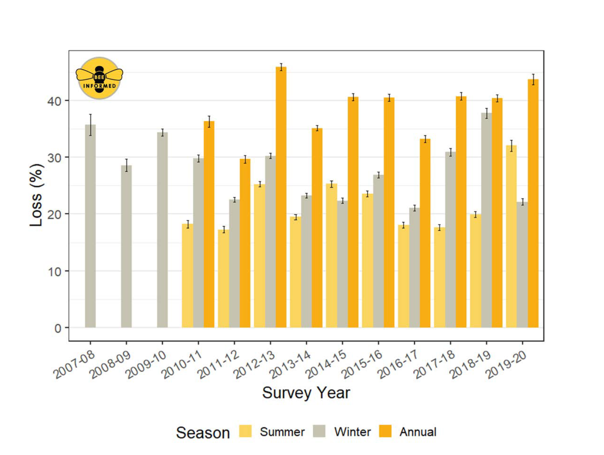
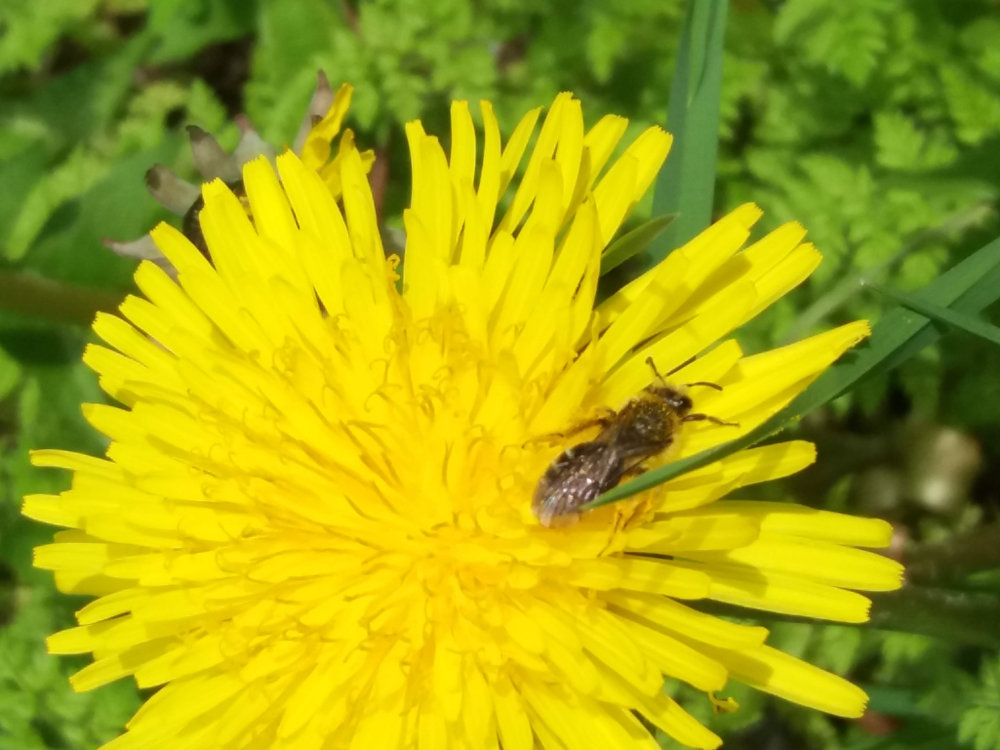
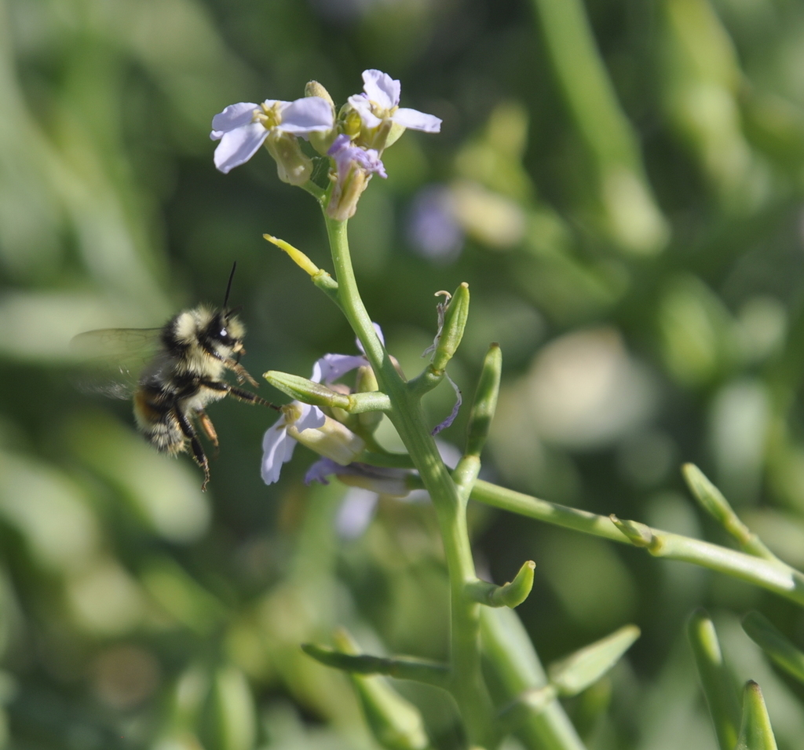
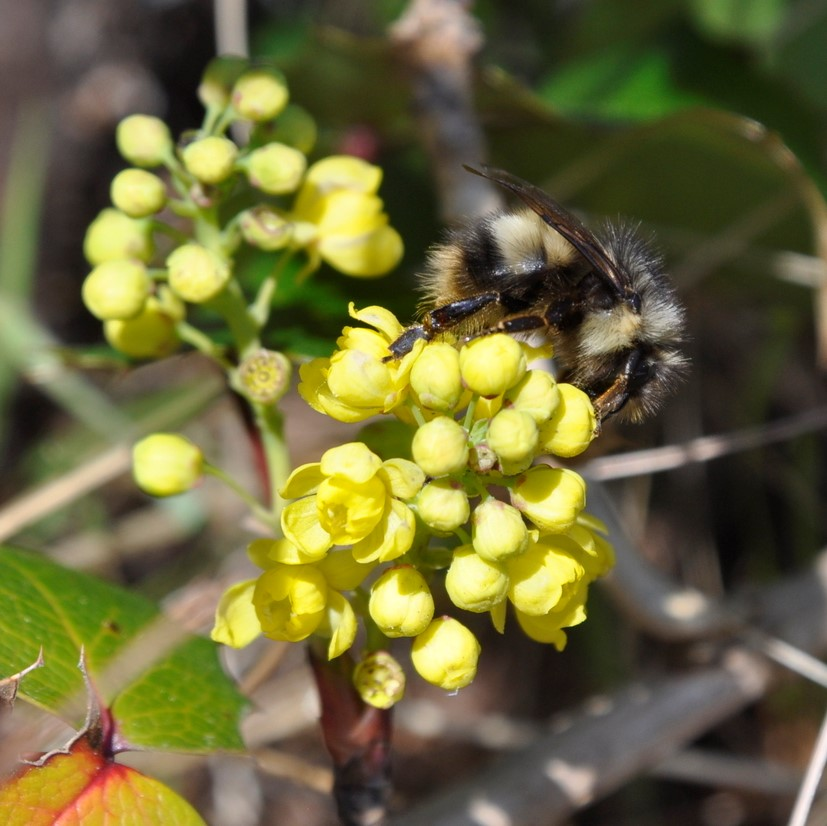
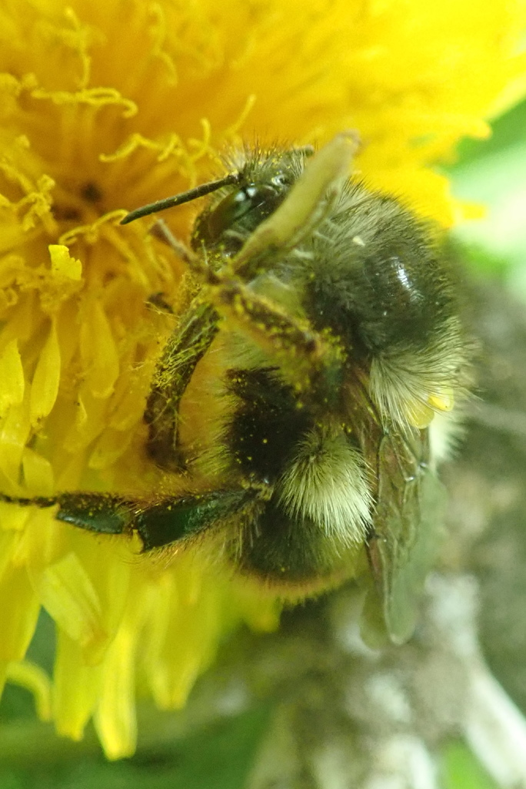
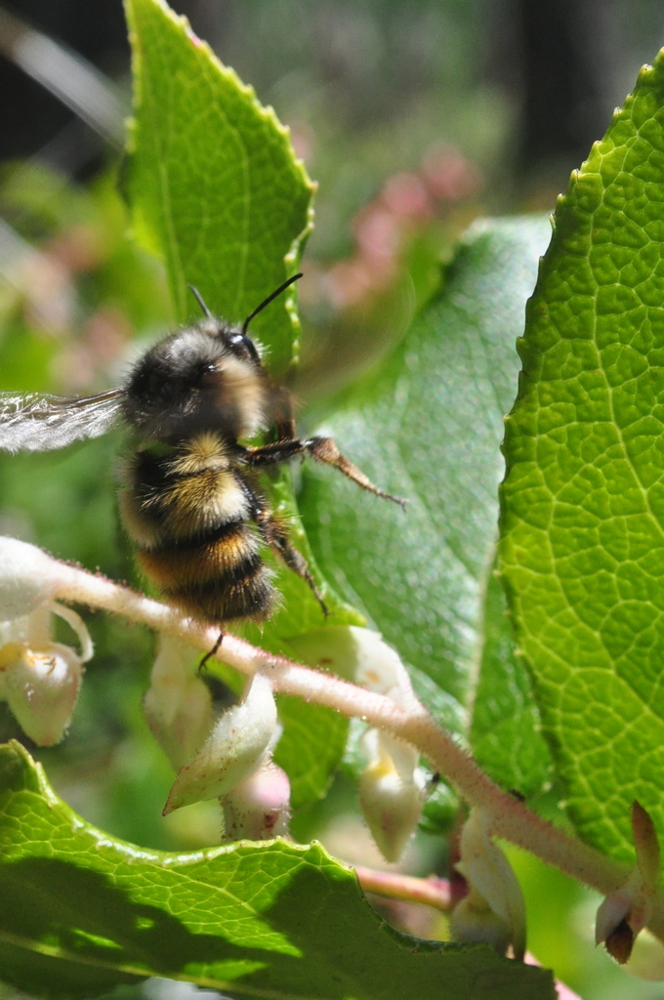
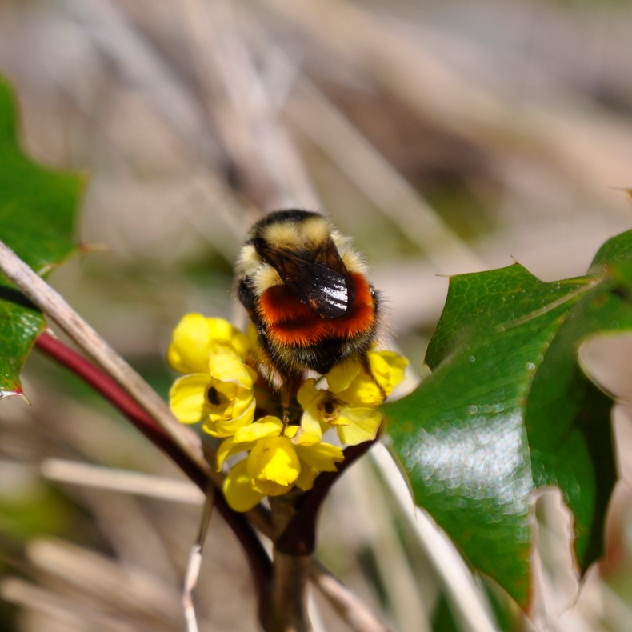
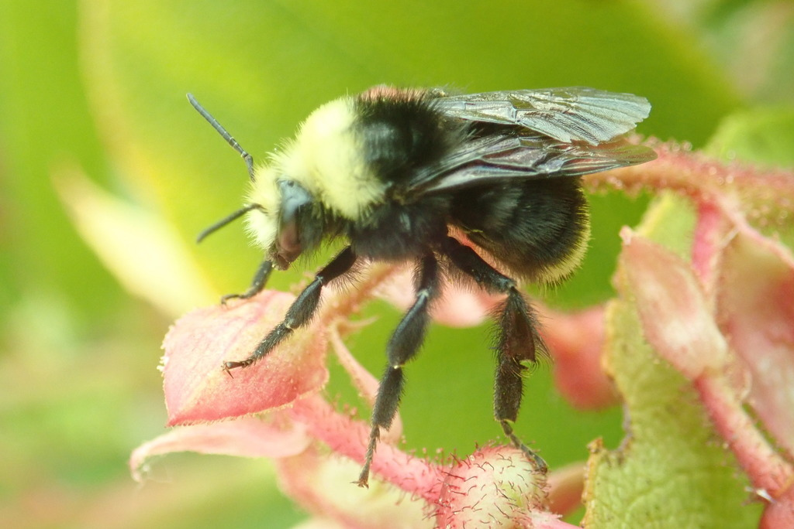

Inspired by Toke Høye’s PollinatorWatch (hosted by [Zooniverse](https://www.zooniverse.org/), we are setting up time-lapse cameras to gather hundreds or maybe thousands of images of pollinators visiting two common native flowering plants, salal and dull Oregon grape, at a mid-island location on Galiano Island, in the Pacific Northwest.   

We plan to automate the analysis of the images to document the number and type of pollinator visitors we get over the flowering season.   

We have also set up a weather station, weather sensors and a particulate matter sensor to gather hyperlocal weather and air quality data in the immediate vicinity of our cameras. In addition to monitoring trends in air quality, the particulate matter sensor should give us an estimate of pollen count and detect smoke from wildfire drift.  

As well as piloting the technology, these observations will be a window to the day-to-day ins and outs of Galiano pollinators that will help us better understand how wildflowers and pollinators are affected by local weather events.  
 

{width=40%}   

Salal (*Gaultheria shallon*) is a leathery-leaved evergreen shrub in the heather family that is native to the Pacific Northwest. It produces delicate, white or pink drooping bell-shaped flowers typically from May to June, which turn into dark blue/black berries at the end of summer.  

 

{width=40%}

Dull Oregon grape (*Mahonia nervosa*) is a small evergreen shrub with serrated spiny edged leaves that produces yellow flowers and blue berries. It is one of the most common understory plants in Pacific Northwest forests.  

# Backgrounder
***

Wild pollinators are an integral part of native plant communities and are highly effective at pollinating flowers in natural ecosystems. Plant pollination is essential for plant reproduction, which in turn provides fruits and seeds for wildlife. Abundance and diversity of pollinators ensure a stable, highly productive ecosystem.   

Changing environmental conditions caused by weather, climate change, or human interventions, may disrupt pollinator activity for some species but enhance it for others. Within natural ecosystems, biodiversity and abundance of wild bee populations and other non-bee pollinators provides redundancy that ensures ongoing pollination and plant productivity despite a changing environment. 
 

Managed pollinators, most commonly honey bees, are super-generalist pollinators that are essential for, or enhance, the pollination and production of many agricultural crops. We rely heavily on honey bees for certain types of food production - for example they are considered essential to sustaining the global supply of almonds - and support billions of dollars worth of food production worldwide. So, it is very worrying that beekeepers report honeybee populations are dwindling, and that their colonies are becoming increasingly vulnerable to environmental stressors. 
 
 

{width=50%}

Adapted from https://beeinformed.org/citizen-science/loss-and-management-survey/  
  
 
Alongside honey bees, wild pollinators including bumble bees, other types of bees, wasps, and other non-bee species, also make important contributions to crop production. Interestingly, on organic farms near natural habitat, wild bees can provide full pollinator services and, as long as diversity is maintained, there is sustained success [^1](Kremen, 2002).   

It seems possible then that by making adjustments that favour abundance and diversity of wild pollinators we could build capacity and resilience within natural and agricultural ecosystems that offset shortfalls in managed pollinator services resulting from the ongoing, perplexing losses of managed colonies. 

 

{width=30%} {width=30%} {width=30%}
 
 

 
  

## Bumble bee species in flux in British Columbia

Decline of bumble bees has been reported in North America and Europe and is of significant global concern [^2](Soroye, 2020). Although there are over 500 known bee species in British Columbia, there is not a lot of historical information about pollinator populations to use as a baseline. However, we do know that at least one bee species, the western bumble bee, *Bombus occidentalis*, has significantly declined [^3](Wray, accessed 28 Mar, 2021). The authors discuss how this bee used to be very common in the lower mainland in the 1980s, representing 25-30% of bumble bee species collected on local berry farms, but by 2003/2004 had dwindled to less than 1% of the bees collected. Since then, *Bombus occidentalis* was sighted just a handful of times on Vancouver Island in 2012, and once in the lower mainland at Boundary Bay in 2013. According to a local newspaper report, it was last spotted on Galiano in 1990. In contrast however, it seems the yellow-faced bumble bee, *B. vosnesenskii*, may be gaining ground in the region [^4](Fraser, 2012). 
 
 
Galiano's bumble bees have recently been under scrutiny in a study to better understand their reliance on habitat diversity in this semi-arid
ecosystem [^5](Simon, 2020). The author identified six species of bumble bees that frequented flowering shrubs in various habitats through spring and summer, and saw fluctuations of bumble bee abundance in different habitats (wet, dry, modified, natural) as the summer progressed. Overall, the Vancouver bumble bee *B. vancouverensis* was the most abundant species, followed by the Sitka bumble bee *B. sitkensis*, while the yellow-faced bumble bee was least abundant. Bumble bee activity and blooming peaked in June in habitat similar to our study site, but even as flowering slowed, high numbers of bumble bees were found to persist through July.

Six bumble bee species of Galiano 

 

{width=20%}    Vancouver bumble bee (*B. vancouverensis*)  

{width=20%}    Sitka bumble bee (*B. sitkensis*)  

{width=20%}     Fuzzy-horned bumble bee (*B. mixtus*)
 
 
{width=20%}   Yellow-fronted bumble bee (*B. flavifrons*)   

 {width=30%}     Orange-rumped bumble bee (*B. melanopygus*)  
 
{width=30%}     Yellow-faced bumbe bee (*B. vosnesenskii*)

 

Photos by [Simon A](https://inaturalist.ca/people/37277), licensed under [CC BY-NC 4.0](www.https://creativecommons.org/licenses/by-nc/4.0/)  

 

### References
 
 
[^1]: Kremen C, Williams NM, Thorp RW. Crop pollination from native bees at risk from agricultural intensification. Proceedings of the National Academy of Sciences. 2002;99(26):16812-6.  

[^2]: Soroye P, Newbold T, Kerr J. Climate change contributes to widespread declines among bumble bees across continents. Science. 2020;367(6478):685-8.    

[^3]: Wray J & Elle E. Simon Fraser University. Wild and managed pollinators: current status and strategies to increase diversity. https://www.sfu.ca/content/dam/sfu/people/eelle/elle_bee_info/Metro_Vancouver_report.pdf Accessed 28 March, 2021.  

[^4]: Fraser DF, Copley CR, Elle E, Cannings RA. Changes in the status and distribution of the yellow-faced bumble Bee. Journal of the Entomological Society of British Columbia. 2012;109:31-7.  
 
 
[^5]: Simon A. Water into nectar: The effects of seasonal drought on bumble bee and flowering plant communities. MSc Thesis, University of Victoria, 2020. Available at https://dspace.library.uvic.ca/handle/1828/11837  
 
 