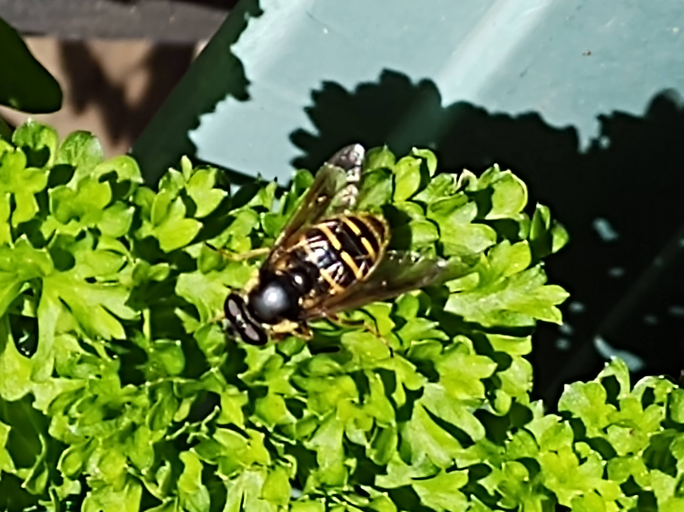
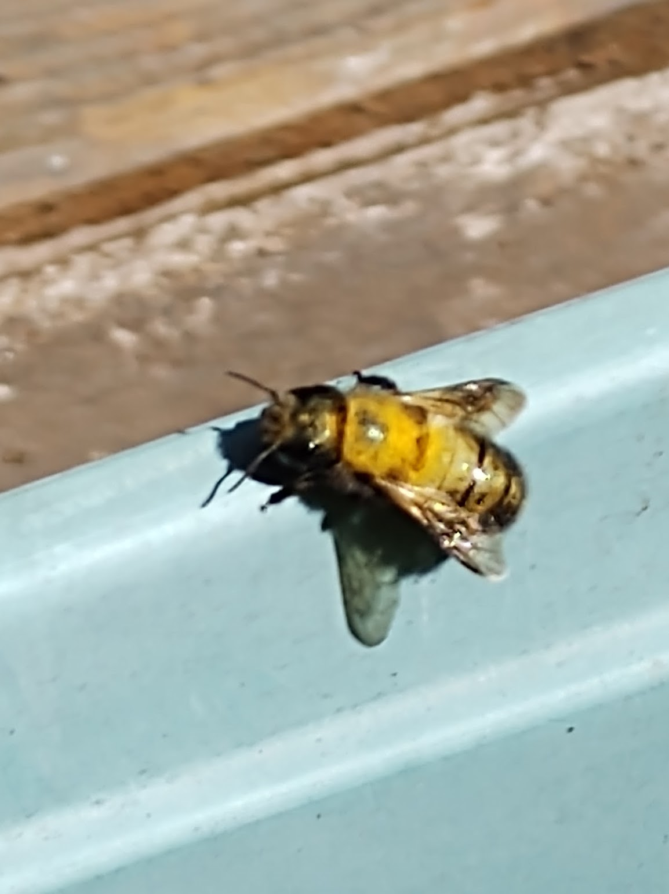

  
March 2021

  
  
 Rufous Hummingbird

  
  
  
 Dull Oregon Grape

  
  
April 2021

  
  

  
  
  
  
  
  
  
 Western Pond Fly

  
  
  
  
  
  
 Pale Swallowtail

  
  
 Osmia

  
  
  
 Salal

  
  

