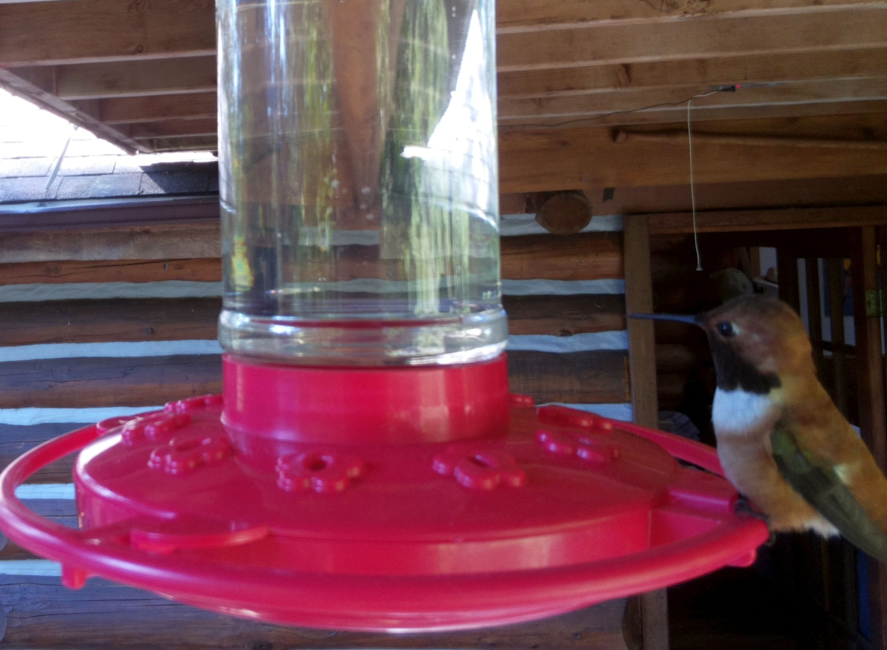
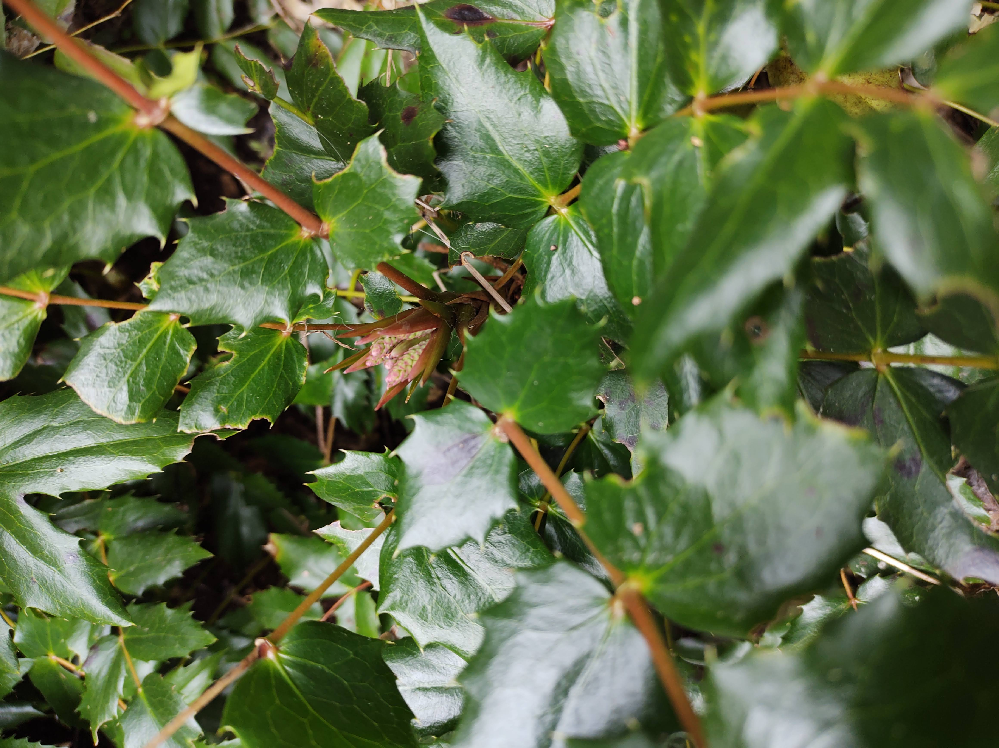
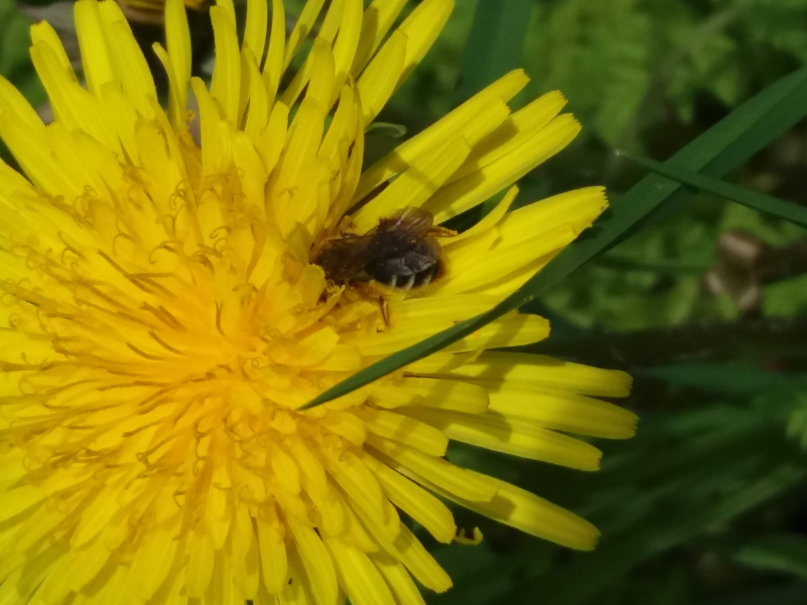
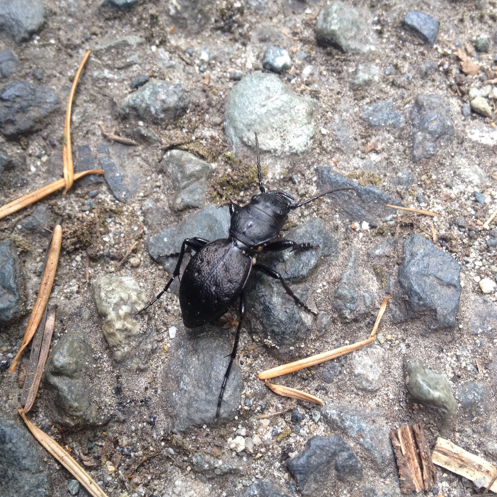
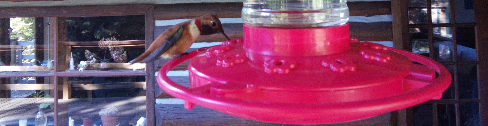
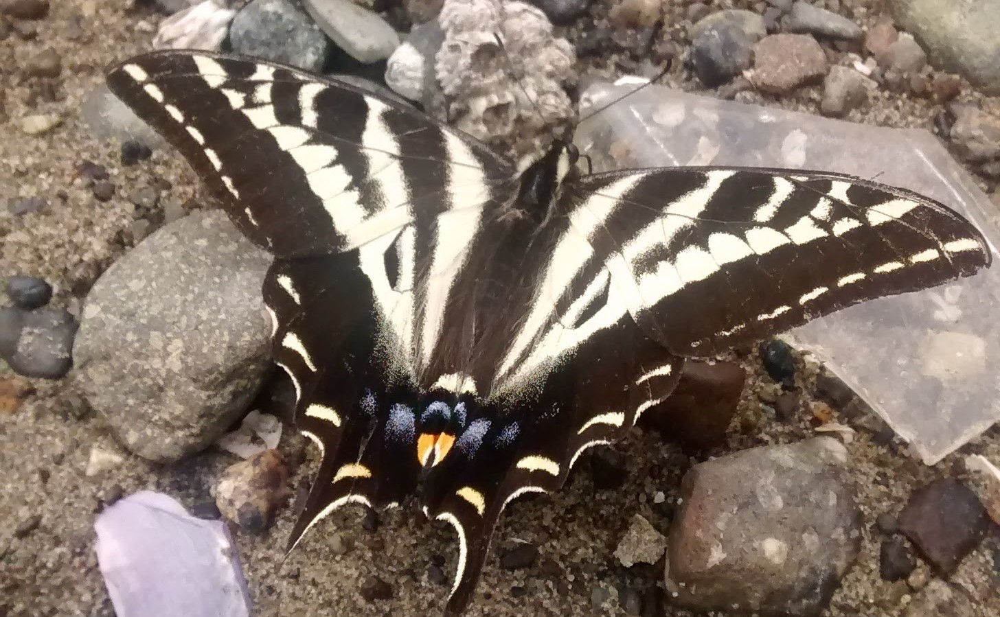

---
output:
  html_document:
    css: ['static/extra.css','static/gallery.css']
---

  
  
  
March 2021

  
  
  
  
 This is a nice hoverfly!

  

  
  
Bee identification in action

  
  
  
  

  
  
  
  
  

  
  
  
  

