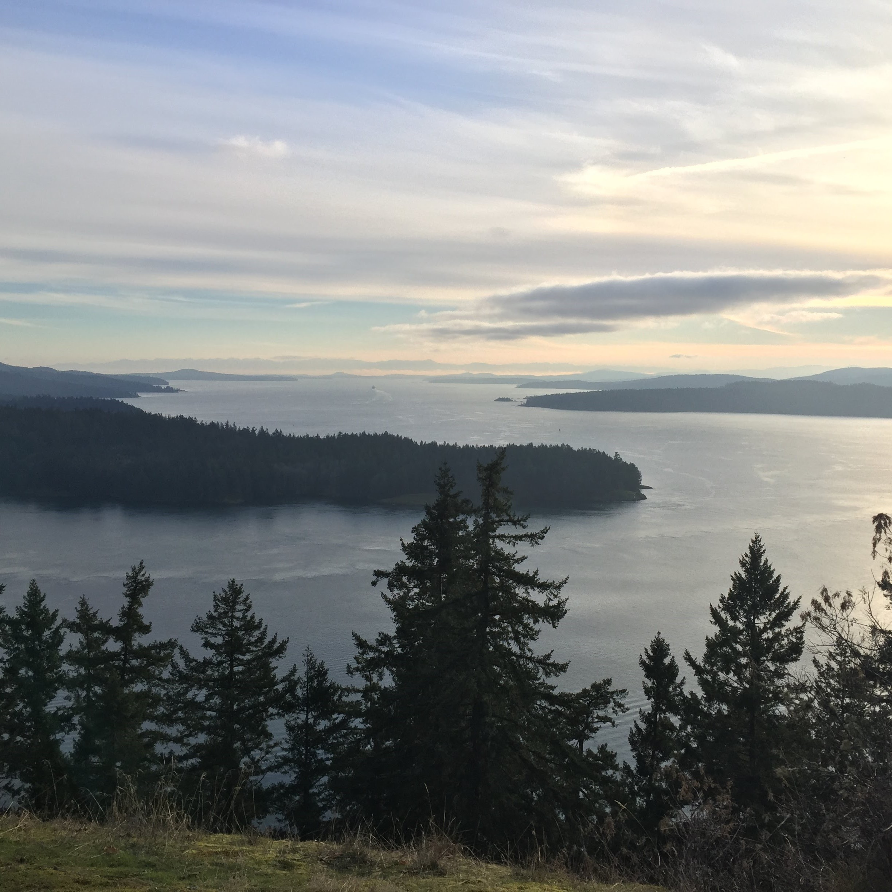
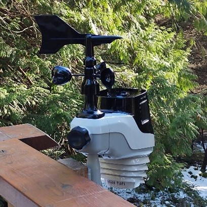
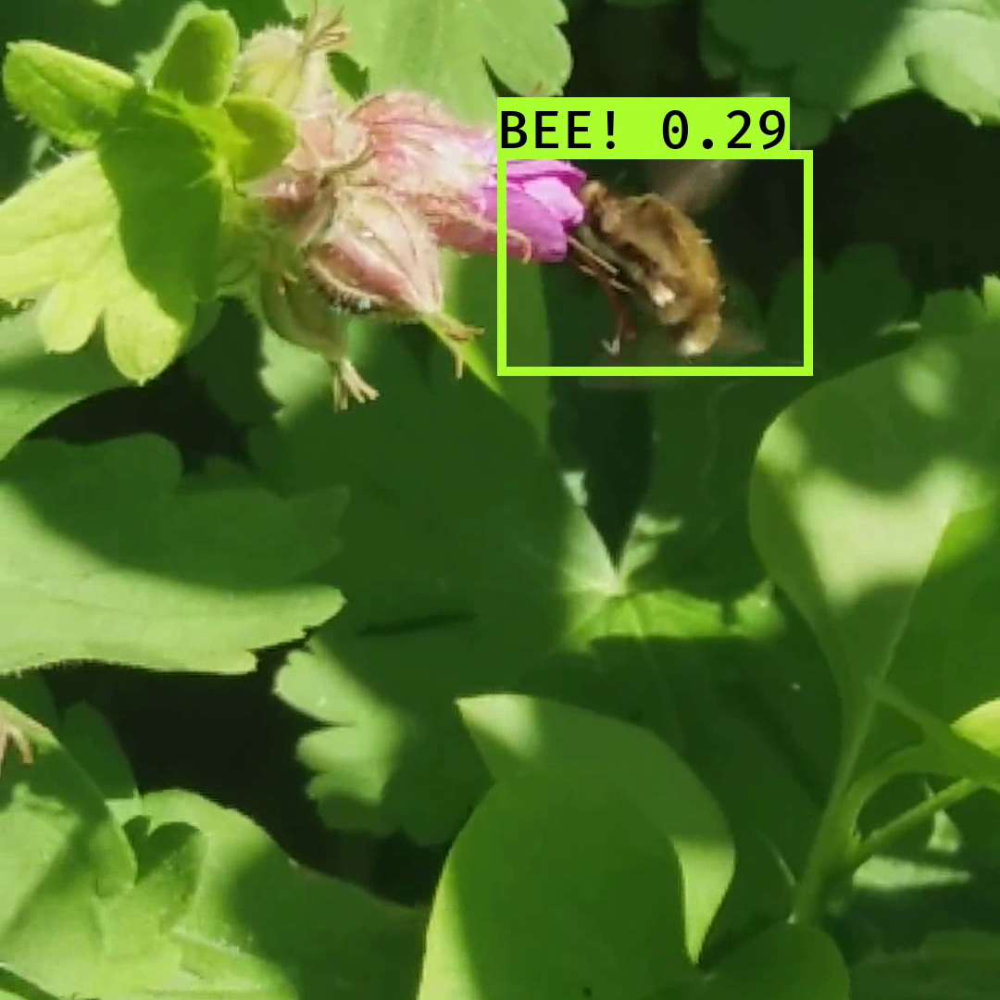

Monitoring pollinator populations on Galiano Island, Canada. We're developing low-cost data collection and analysis systems for long-term pollinator surveillance and hyperlocal weather and climate monitoring.

 

<link rel="stylesheet" href="//use.fontawesome.com/releases/v5.0.7/css/all.css">

<a target="_top" href="info.html#the_site">
     
  
   
  
The Site

  
Learn more  <i class="fas fa-arrow-right"></i>

  

</a>

<a target="_top" href="info.html#weather_monitoring">
     
  
   
  
Weather Monitoring

  
Learn more  <i class="fas fa-arrow-right"></i>

  

</a>

<a target="_top" href="info.html#pollinator_detection">
     
  
 
  
Pollinator Detection

  
Learn more  <i class="fas fa-arrow-right"></i>

  

</a>

